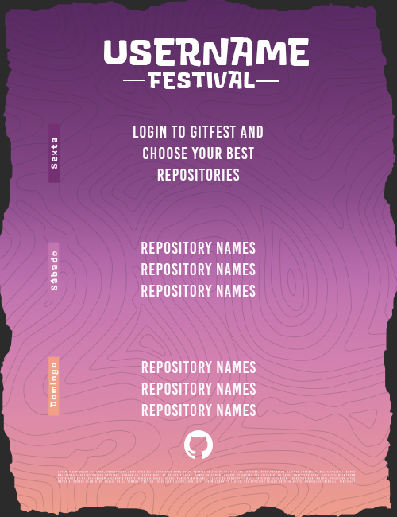

<h1 align="center">
  <br>
    <a href="https://gitfest.netlify.app/">
      
    </a>
  <br>
  GitFest
  <br>
</h1>

<h4 align="center">Create a festival lineup
from your top <a href="https://github.com/" target="_blank">Github</a> repositories.</h4>

<p align="center">
  
  
  
</p>

<p align="center">
  <a href="#key-features">Key Features</a> •
  <a href="#how-to-use">How To Use</a> •
  <a href="#related">Related</a> •
  <a href="#license">License</a>
</p>

<p align="center">
  
  <br>
  Festival Lineup Result
</p>

## Key Features

* Create your own Lineup, see your repositories like never before
* Dark/Light mode
  - Giving attention to prefer-color-scheme.
* Github OAuth integration
* Github API consuming
* Manipulating SVG
* Save the result as image

## How To Use

To clone and run this application, you'll need [Git](https://git-scm.com) and [Node.js](https://nodejs.org/en/download/) (which comes with [npm](http://npmjs.com)) installed on your computer. From your command line:

```bash
# Clone this repository
$ git clone https://github.com/Igorcbraz/GitFest

# Go into the repository
$ cd GitFest

# Install dependencies
$ npm install

# Run the app
$ npm start
```

> **Note**
> If you're using Linux Bash for Windows, [see this guide](https://www.howtogeek.com/261575/how-to-run-graphical-linux-desktop-applications-from-windows-10s-bash-shell/) or use `node` from the command prompt.


## Related

[Instafest](https://www.instafest.app/) - Version to create festival lineup by your top songs

[Receiptify](https://receiptify.herokuapp.com/) - Get most played tracks in a Receipt format

## You may also like...

- [Calculator](https://github.com/Igorcbraz/Calculadora) - Explain prefer-color-scheme with calculator project
- [GitFest Article](https://medium.com/@igorcbraz/create-a-festival-lineup-with-your-github-repositories-49229026f042) - Medium post talking more about GitFest

## License

MIT


## Support

<a href="https://www.buymeacoffee.com/igorcbraz" target="_blank"></a>

---

> GitHub [@Igorcbraz](https://github.com/Igorcbraz) &nbsp;&middot;&nbsp;
> Linkedin [@Igorcbraz](https://www.linkedin.com/in/igorcbraz/)
